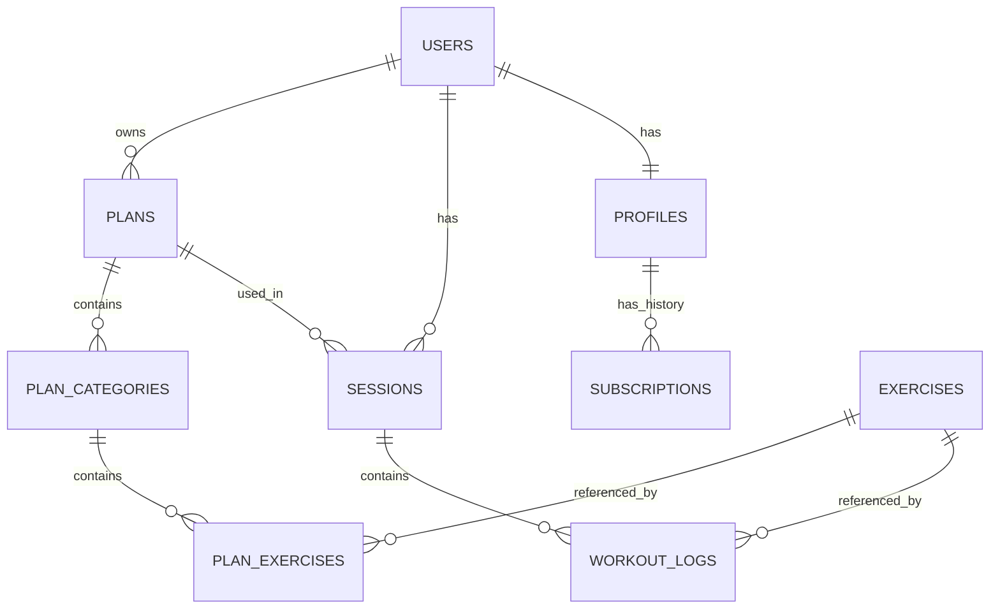

# Gym Tracker

Aplikasi tracking workout pribadi — catat exercise, set, reps, dan berat per sesi gym, dengan fitur flashback untuk membandingkan progress minggu lalu, bulan lalu, hingga tahun lalu.

## Tahapan pengembangan

1. **Personal use** — dipakai sendiri dulu
2. **Dibagikan ke teman** — beberapa orang ikut pakai
3. **Publish & berbayar** — dirilis publik dengan model freemium (free / pro)

## Tech stack

| Layer | Teknologi |
|---|---|
| Frontend & backend | Next.js |
| Database & Auth | Supabase (PostgreSQL + Supabase Auth) |
| Data exercise | WorkoutX API (di-sync ke database lokal) |
| Payment (tahap 3) | Midtrans |
| Hosting | Vercel + Supabase |

## Alur sistem

### Sinkronisasi data exercise

```
WorkoutX API → Sync job (cron) → Supabase (tabel exercises) → Next.js app → User
```

Sync job menarik data exercise dari WorkoutX API secara berkala (bukan real-time per request user) dan menyimpannya sebagai local mirror di tabel `exercises`. Free tier WorkoutX (500 request/bulan, maksimal 10 hasil per request) lebih dari cukup karena sync ini hanya berjalan sesekali, bukan setiap kali user membuka halaman.

### Loop harian (logging workout)

```
User → Next.js app → Supabase (tabel sessions, workout_logs)
```

Ini loop yang berjalan setiap hari user nge-gym, sepenuhnya independen dari WorkoutX API — tidak memakan kuota API sama sekali karena hanya menulis ke database sendiri.

### Pola input yang dipakai

Input dilakukan **per-exercise, saat istirahat sebelum pindah ke exercise berikutnya** — bukan per-set (terlalu sering, mengganggu rest period) dan bukan di akhir sesi penuh (berisiko lupa angka). Setiap exercise menampilkan beberapa baris set yang diisi sekaligus saat istirahat, dengan berat pre-filled dari sesi terakhir untuk exercise yang sama.

## Struktur halaman

### Area publik (sebelum login)
- **Landing page** — perkenalan produk
- **Exercise page** — katalog exercise publik (dari data yang sudah disync)

### Area setelah login
- **Dashboard** — ringkasan aktivitas hari ini, shortcut ke catat workout
- **Daftar exercise** — cari & lihat detail gerakan, riwayat personal per exercise
- **Riwayat & flashback** — bandingkan progress (minggu ini vs minggu lalu, vs tahun lalu), per exercise atau per kategori
- **Catatan workout** — buat & jalankan paket latihan harian, terbagi per kategori otot (misal Senin: Dada, Back, Bicep)
- **Profil & settings** — info akun, satuan berat, status subscription (tahap 3)

## Konsep data: Template vs Log

Dua hal yang dipisahkan sengaja agar histori tidak rusak saat rencana latihan berubah:

- **Template (`plans` → `plan_categories` → `plan_exercises`)** — rencana latihan yang bisa diedit kapan saja (ganti, tambah, hapus exercise per kategori). Perubahan di sini **tidak memengaruhi** data yang sudah tercatat.
- **Log aktual (`sessions` → `workout_logs`)** — catatan permanen tiap kali latihan, terikat ke tanggal dan exercise spesifik. Ini yang terus bertambah setiap sesi gym, dan menjadi basis fitur flashback.

## Skema database

### Diagram relasi (ERD)



### DDL lengkap

```sql
-- ============================================================
-- EXERCISES — local mirror dari WorkoutX API
-- ============================================================
create table exercises (
  id text primary key,              -- pakai ID asli dari WorkoutX, bukan uuid
  name text not null,
  body_part text,
  target text,
  equipment text,
  gif_url text,
  instructions text[],
  created_at timestamptz default now()
);

-- ============================================================
-- PROFILES — extend auth.users, simpan status plan
-- ============================================================
create table profiles (
  id uuid primary key references auth.users(id) on delete cascade,
  plan_tier text not null default 'free' check (plan_tier in ('free', 'pro')),
  pro_expires_at timestamptz,
  created_at timestamptz default now()
);

-- ============================================================
-- SUBSCRIPTIONS — riwayat transaksi pembayaran (tahap 3)
-- ============================================================
create table subscriptions (
  id uuid primary key default gen_random_uuid(),
  user_id uuid not null references auth.users(id) on delete cascade,
  status text not null check (status in ('active', 'expired', 'cancelled')),
  started_at timestamptz not null default now(),
  expires_at timestamptz not null,
  payment_ref text,
  created_at timestamptz default now()
);

-- ============================================================
-- PLANS — template paket latihan milik user
-- ============================================================
create table plans (
  id uuid primary key default gen_random_uuid(),
  user_id uuid not null references auth.users(id) on delete cascade,
  name text not null,
  created_at timestamptz default now()
);

-- ============================================================
-- PLAN_CATEGORIES — kategori otot per hari dalam satu plan
-- ============================================================
create table plan_categories (
  id uuid primary key default gen_random_uuid(),
  plan_id uuid not null references plans(id) on delete cascade,
  category_name text not null,      -- contoh: 'Dada', 'Back', 'Bicep'
  day_of_week text,                 -- contoh: 'senin'
  created_at timestamptz default now()
);

-- ============================================================
-- PLAN_EXERCISES — daftar exercise dalam satu kategori
-- ============================================================
create table plan_exercises (
  id uuid primary key default gen_random_uuid(),
  category_id uuid not null references plan_categories(id) on delete cascade,
  exercise_id text not null references exercises(id),
  sort_order int default 0,
  created_at timestamptz default now()
);

-- ============================================================
-- SESSIONS — satu sesi gym pada tanggal tertentu
-- ============================================================
create table sessions (
  id uuid primary key default gen_random_uuid(),
  user_id uuid not null references auth.users(id) on delete cascade,
  plan_id uuid references plans(id),
  workout_date date not null default current_date,
  created_at timestamptz default now()
);

-- ============================================================
-- WORKOUT_LOGS — catatan aktual tiap set (inti fitur flashback)
-- ============================================================
create table workout_logs (
  id uuid primary key default gen_random_uuid(),
  session_id uuid not null references sessions(id) on delete cascade,
  exercise_id text not null references exercises(id),
  set_number int not null,
  reps int,
  weight_kg numeric(6,2),
  created_at timestamptz default now()
);

-- ============================================================
-- INDEX — untuk performa query flashback
-- ============================================================
create index idx_workout_logs_exercise on workout_logs(exercise_id);
create index idx_sessions_user_date on sessions(user_id, workout_date);
create index idx_workout_logs_session on workout_logs(session_id);
```

## Row Level Security (RLS)

Semua tabel yang menyimpan data milik user wajib RLS aktif sejak hari pertama. Tabel `exercises` dikecualikan karena isinya data publik (katalog, bukan data personal).

```sql
-- Aktifkan RLS
alter table profiles enable row level security;
alter table subscriptions enable row level security;
alter table plans enable row level security;
alter table plan_categories enable row level security;
alter table plan_exercises enable row level security;
alter table sessions enable row level security;
alter table workout_logs enable row level security;

-- PROFILES — user hanya bisa lihat & update profil sendiri
create policy "view own profile" on profiles
  for select using (auth.uid() = id);
create policy "update own profile" on profiles
  for update using (auth.uid() = id);

-- SUBSCRIPTIONS — user hanya bisa lihat riwayat sendiri (insert/update lewat service_role di webhook)
create policy "view own subscriptions" on subscriptions
  for select using (auth.uid() = user_id);

-- PLANS
create policy "manage own plans" on plans
  for all using (auth.uid() = user_id);

-- PLAN_CATEGORIES — akses lewat relasi ke plans
create policy "manage own plan categories" on plan_categories
  for all using (
    auth.uid() = (select user_id from plans where plans.id = plan_categories.plan_id)
  );

-- PLAN_EXERCISES — akses lewat relasi ke plan_categories -> plans
create policy "manage own plan exercises" on plan_exercises
  for all using (
    auth.uid() = (
      select p.user_id from plans p
      join plan_categories pc on pc.plan_id = p.id
      where pc.id = plan_exercises.category_id
    )
  );

-- SESSIONS
create policy "manage own sessions" on sessions
  for all using (auth.uid() = user_id);

-- WORKOUT_LOGS — akses lewat relasi ke sessions
create policy "manage own workout logs" on workout_logs
  for all using (
    auth.uid() = (select user_id from sessions where sessions.id = workout_logs.session_id)
  );
```

Catatan penting:
- `for all` mencakup `select`, `insert`, `update`, `delete` sekaligus — jangan lupa cek tiap operasi, bukan hanya `select`.
- `service_role key` (dipakai untuk webhook payment & sync job) **bypass semua RLS**. Kunci ini hanya boleh dipakai di server-side (API routes/server actions), tidak boleh sampai ke client bundle.
- `anon key` (dipakai di client-side) selalu tunduk pada RLS di atas — jadikan ini cara utama memverifikasi RLS bekerja: test pakai `anon key`, bukan `service_role key`.

## Login dengan Google (Supabase Auth)

Tidak perlu tabel tambahan — Google login otomatis masuk ke `auth.users` yang sama seperti login email/password, hanya beda `provider`.

### Setup

1. **Google Cloud Console**
   - Buat project baru (atau pakai yang sudah ada)
   - Buka **APIs & Services → Credentials**
   - Buat **OAuth client ID**, tipe **Web application**
   - Tambahkan **Authorized redirect URI**: `https://<project-ref>.supabase.co/auth/v1/callback`
   - Catat **Client ID** dan **Client Secret**

2. **Supabase Dashboard**
   - Buka **Authentication → Providers → Google**
   - Aktifkan, masukkan **Client ID** dan **Client Secret** dari langkah 1
   - Simpan

3. **Next.js**
   ```ts
   import { createClient } from '@supabase/supabase-js'

   const supabase = createClient(
     process.env.NEXT_PUBLIC_SUPABASE_URL!,
     process.env.NEXT_PUBLIC_SUPABASE_ANON_KEY!
   )

   async function signInWithGoogle() {
     await supabase.auth.signInWithOAuth({
       provider: 'google',
       options: { redirectTo: `${location.origin}/dashboard` },
     })
   }
   ```

4. **Trigger otomatis buat profile** — setiap user baru (lewat provider apa pun) perlu baris di `profiles`. Tambahkan trigger di Supabase:
   ```sql
   create function public.handle_new_user()
   returns trigger as $$
   begin
     insert into public.profiles (id, plan_tier)
     values (new.id, 'free');
     return new;
   end;
   $$ language plpgsql security definer;

   create trigger on_auth_user_created
     after insert on auth.users
     for each row execute procedure public.handle_new_user();
   ```

## Environment variables

```
NEXT_PUBLIC_SUPABASE_URL=
NEXT_PUBLIC_SUPABASE_ANON_KEY=
SUPABASE_SERVICE_ROLE_KEY=        # server-side only, jangan expose ke client
WORKOUTX_API_KEY=
MIDTRANS_SERVER_KEY=               # tahap 3
MIDTRANS_CLIENT_KEY=                # tahap 3
```

## Catatan WorkoutX API

- Base URL: `https://api.workoutxapp.com/v1`
- Auth via header `X-WorkoutX-Key`
- Free tier: 500 request/bulan, maksimal 10 hasil per request — sync penuh ±1.400 exercise butuh sekitar 140 request, masih jauh di bawah kuota bulanan
- Endpoint utama sync: `GET /v1/exercises?limit=10&offset=0` (pagination)
- Data hasil sync disimpan permanen di tabel `exercises` — fitur logging harian tidak pernah memanggil API ini langsung
